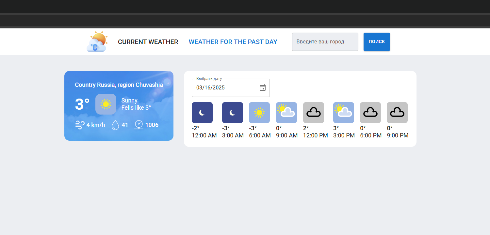

# your-weather

Welcome to YourWeather, an intuitive web application built with cutting-edge technologies to provide you with weather forecasts and a comfortable user experience.

**Technologies Used:**

- React.js: Powering the dynamic and responsive user interface.<br/>
- Redux Toolkit: Managing the state of the application efficiently.<br/>
- RTK Query: It was used to make API requests and manage data.<br/>
- TypeScript: Ensuring a robust and statically-typed codebase.<br/>
- Webpack: It was used to build a project, optimize resources, and manage dependencies.<br/>
- ESLint: Ensuring code quality and adherence to best practices. \*[Weatherbit.io](https://weatherstack.com) API: Fetching real-time weather data for accurate forecasts.<br/>

**Specifications:**

- On the main page, you can find out the weather in your region if you allow access to your geodata, or manually enter your region name.<br/>
- On the "history" page you can find out what the weather was like in the city in the past.<br/>

**Installation:**

```
npm i
npm run start
```

Runs the app in the development mode. Open http://localhost:3000 to view it in your browser.

**To automatically determine the region, please allow access to your geo data.**



